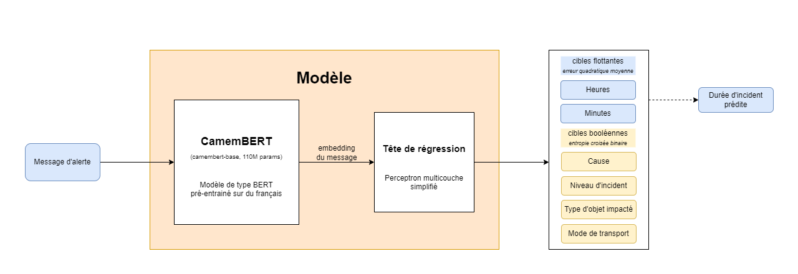
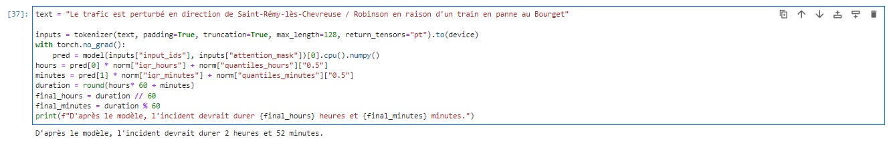
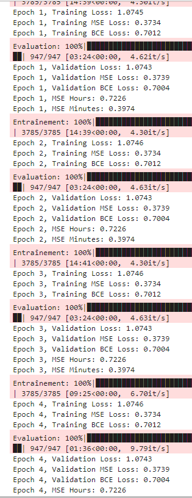

# Prédire la durée des incidents sur le réseau francilien à partir des alertes de trafic ?

#### LARTIGAU Théo et SIAHAAN--GENSOLLEN Rémy

Tout le monde ou presque s'est déjà retrouvé confronté à des incidents dans les transports en commun : un jour, alors
qu'on se rend à un rendez-vous important, notre train est soudainement bloqué, ou il est en retard, ou ne vient juste
pas. On n'a parfois qu'une annonce simple, une alerte de trafic qui ressemble peu ou proue à ça :


_Source : X (anciennement Twitter)._

Comme le montre cet exemple, ces messages ne sont parfois pas d'une grande aide. Souvent, avoir une idée de la durée
de l'incident peut s'avérer utile, voire très utile, ne serait-ce que pour prévenir du retard, ou mieux planifier
un trajet alternatif. Dans ce projet, on se propose d'entraîner un modèle sur les données fournies par l'API d'IDF
Mobilités sur les perturbations du réseau francilien, contenant notamment les messages et les durées, afin d'essayer
de répondre à ce problème. Nous analyserons également ces données de sorte à mieux comprendre la nature des
perturbations sur le réseau de transports en commun d'Île-de-France.

Ce fichier détaille notre démarche et les résultats obtenus, ainsi que des considérations pratiques vis-à-vis du projet
(fonctionnement, reproductibilité…).

#### Table des matières
- [Structure du projet](#struct)
  - [Code](#code)
  - [Dépendances](#dep)
  - [Variables d'environnement](#env)
  - [Accélération GPU](#gpu)
- [Démarche](#work)
  - [Scraping de l'API IDF Mobilités](#scraping)
  - [Pré-traitement des données](#preprocessing)
  - [Analyse des données](#analysis)
- [Modèle](#model)
  - [Traitement des données](#processing)
  - [Entraînement et évaluation](#traineval)
- [Résultats](#results)
- [Discussion](#discussion)


<a name="struct"></a>
## Structure du projet

<a name="code"></a>
#### Code
Le code est situé dans le dossier `src`, et sa stucture peut être suivie via un notebook principal `main.ipynb`.
Des parties du code ne sont cependant pas directement dedans :

- le scraping périodique de l'API IDF Mobilités est effectué par une GitHub Action paramétrée dans
  `.github/workflows.scheduler.yml`, qui éxécute le fichier `scraping-job.py`. Les réponses brutes de l'API IDF Mobilités
  sont directement stockées au format JSON dans un bucket du SSP Cloud. Voir [Scraping de l'API IDF Mobilités](#scraping)
  pour plus de détails.

- Le pré-traitement des données, qui peut être un peu long, est effectué à part dans le notebook `preprocessing.ipynb`.
  Les données sont enregistrées dans le dossier `src/data` au format _feather_. Voir
  [Pré-traitement des données](#preprocessing) pour plus de détails.

- Une partie de l'analyse, notamment l'augmentation des données avec CamemBERT, est effectué à part dans le notebook
  `analysis.ipynb`. Voir [Analyse des données](#analysis) pour plus de détails.

- L'entraînement et l'évaluation du modèle, particulièrement conséquent, effectués dans le notebook `model.ipynb`. Voir
  [Modèle](#model) pour plus de détails.


<a name="dep"></a>
#### Dépendances
Le fichier `requirements.txt` liste selon les conventions les dépendances du projet. Il est possible d'installer
ces dépendances via

```bash
pip install -r requirements.txt
```

Une cellule avec cette commande est sinon disponible dans chaque notebook.

<a name="env"></a>
#### Variables d'environnement
Le projet requiert plusieurs variables d'environnement, notamment une clé sur
l'[API IDF Mobilités](https://prim.iledefrance-mobilites.fr/fr) et un compte de service pour l'accès MinIO du SSP Cloud
(voir la [documentation du SSP Cloud](https://docs.sspcloud.fr/content/storage.html#cr%C3%A9er-un-compte-de-service)
à ce sujet). Ces variables peuvent être stockées dans un fichier `.env` sur la racine, suivant les conventions.
Le fichier `.env.example` détaille la structure et le nom des variables :

```py
## Clé de l'API IDF Mobilités
# voir https://prim.iledefrance-mobilites.fr/fr
IDFM_API_KEY=""

## Configuration du système de stockage
MINIO_S3_ENDPOINT="https://minio.lab.sspcloud.fr"
MINIO_ROOT="username/projet-python-2A"
# On utilise un compte de service
# voir https://docs.sspcloud.fr/content/storage.html#cr%C3%A9er-un-compte-de-service
MINIO_KEY=""
MINIO_SECRET_KEY=""
```

<a name="gpu"></a>
#### Accélération GPU

Les opérations effectuées au cours de ce projet peuvent être assez longue. Pour gagner du temps (ou simplement parce
les CPU n'étaient parfois pas adaptés) nous avons utilisé des GPU, notamment ceux mis en place par le SSP Cloud.
Ceux du SSP Cloud fonctionnent avec CUDA 12, et on peut alors installer cuDF pour cette version avec le code suivant :

```bash
!pip install --extra-index-url=https://pypi.nvidia.com cudf-cu12==24.12.* dask-cudf-cu12==24.12.* cuml-cu12==24.12.* cugraph-cu12==24.12.*
```

puis le charger dans les notebooks avec ```%load_ext cudf.pandas```. Pour les versions adaptées à CUDA 11, il faut se
référer à la [documentation RAPIDS](https://docs.rapids.ai/install/). Une cellule avec cette commande est sinon
disponible dans chaque notebook.

<a name="struct"></a>
## Démarche

<a name="scraping"></a>
#### Scraping de l'API IDF Mobilités

La première étape de ce projet a consisté à récupérer les données concernant les incidents sur le réseau francilien.
IDF Mobilités possède plusieurs comptes sur des réseaux sociaux — principalement X, anciennement Twitter — mais les API
d'accès de ces réseaux sont plutôt onéreuses, et par ailleurs ces comptes à eux seuls ne représentent pas exhaustivement
toute l'information disponible.

Une autre approche est plutôt de se tourner vers la plateforme PRIM (Plateforme Régionale d'Information pour la
mobilité) gérée par IDF Mobilités. Celle-ci dispose de plusieurs APIs, dont une qui a été mise en place pour les jeux
olympiques de Paris 2024 : L’[API Messages Info
Trafic](https://prim.iledefrance-mobilites.fr/fr/apis/idfm-disruptions_bulk), qui renvoie l'intégralité des informations
de perturbation en cours et à venir, ainsi que la liste des lignes et arrêts concernés.

Cependant celle-ci ne propose qu'un endpoint renvoyant les perturbations en cours au moment de la requête. Nous avons
donc créé un script (`scraping-job.py`) qui requête cette API et stocke de manière horodatée la réponse dans le stockage
du SSP Cloud, éxécuté périodiquement par une GitHub action.

L'action est en théorie censée s'exécuter toutes les deux minutes ainsi que paramétrée par la tache CRON
(`.github/workflows/scheduler.yml`) et selon ce que permettaient les quotas d'utilisations de l'API IDF Mobilités. En
pratique, nous nous sommes rendus compte après analyse qu'une partie des perturbations dure moins de deux minutes, ce qui
les laisse passer sous le radar. Par ailleurs, et c'est le principal défaut, les workers proposés par GitHub (même dans
la version pro) ne garantissent pas l'exécution à temps des tâches CRON (voir le
[forum communautaire GitHub](https://github.com/orgs/community/discussions/27130)). Une solution aurait été de faire
tourner sois-même un worker (ou la tâche CRON directement), mais nous ne disposions pas de serveur pour faire cela.

**Nous avons fait tourner le script de scraping du 6 décembre 2024 à 13h50, jusqu'au 29 décembre à 20h56.**

<a name="preprocessing"></a>
#### Pré-traitement des données `preprocessing.ipynb`

Les données issues du scraping de l'API IDF Mobilités ne constituent pas un jeu de données en tant que tel. L'on a donc
cherché à transformer ces données brutes, stockées sur le SSP Cloud, en un jeu de données exploitable. Les fichiers
JSON issus du scraping contiennent des informations sur les perturbations du réseau francilien, comme leurs causes,
gravités et périodes d'application (il faut noter la quantité d'information donnée par l'API — les champs disponibles
dans la réponse — varie d'une requête à une autre). Ces perturbations impactent certains objets, entités spécifiques
du réseau : lignes de transport, ou arrêts sur ces lignes, permettant de localiser précisément les perturbations.

Pour cela, nous avons filtré les doublons, et structurés les données en trois tables principales. Une pour les
perturbations, une pour les objets impactés (lignes, stations), et une faisant la jointure entre les deux : un lien
objet-perturbation, correspondant à une perturbation unique sur une période unique et pour un objet impacté unique.
Ainsi, une perturbation sur deux périodes et impactant trois objets (par exemple des travaux sur deux week-ends et
affectant trois lignes) correspondra à six liens objet-perturbation. Cet aplatissement est plus pratique pour étudier
_in fine_ les perturbations.

Les données ainsi nettoyées ont été converties en DataFrames pandas. Créer des DataFrames plus rudimentaires puis les
raffiner s'avérait être un processus très complexe du fait d'objets imbriqués et de listes de longueurs variables dans
nos données brutes. Au final, nous avons :

| Catégorie                               | Total     | Total (sans doublons) |
|-----------------------------------------|-----------|-----------------------|
| Résultats                               | 2 357     | 2 357                 |
| Perturbations traitées                  | 1 724 401 | 30 177                |
| Objets impactés traités                 | 5 476 570 | 7 570                 |
| Liens objet-perturbation traités        | -         | 102 807               |

Le Pré-traitement pouvant être long, en particulier sur CPU, nous avons enregistré ces jeux de données dans le dossier
`src/data`, au format _feather_. Ce format était idéal pour nous, car bien moins volumineux que le CSV (notamment du fait
de la présence de messages en texte plein, qui alourdissaient considérablement les fichiers si non stockés en binaire),
et sur lesquels ils nous étaient plus rapide d'itérer qu'avec _parquet_.

<a name="analysis"></a>
#### Analyse des données

Nous cherchons à atteindre plusieurs objectifs via l'analyse des données, ils sont l'identification :

- des lignes et des tronçons les plus problématiques sur le réseau IDF Mobilités ;
- des types de perturbations les plus fréquentes ;
- de potentiels problèmes dans la restitution des données par l'API IDF Mobilités.

Parmi les objets impactés, nous avons pu récupérer l'ensemble des lignes de métro, de RER et la quasi-totalité des
lignes de Tramway francilien sur la période de scraping. Nous avons aussi récupéré la moitié des lignes de Transilien et
les deux-tiers lignes de bus du réseau.

L'analyse des données sur les incidents nous a permis de constater que hormis les informations sur la temporalité
d'une perturbation, la quasi-totalité des informations la concernant sont contenues dans le message d'information
associé à celle-ci. Le traitement du langage naturel est donc apparu comme étant une solution pour augmenter le jeu
de données, surtout si nous souhaitons identifier les _types_ de perturbations les plus fréquentes. L'API IDF Mobilités
ne précise que si une perturbation est due à des travaux, et ce, de façon non systématique.

Notre analyse de la durée des perturbations, importante, car il s'agit de la variable que nous cherchons à prédire, nous
a amené à observer une distribution non-usuelle. Nos observations sont détaillées dans le notebook.


Néanmoins, nous n'avons pas réussi à identifier les lignes les plus problématiques du réseau de transports. Nous avons
en effet fini par constater que l'API IDF Mobilités renvoyait parfois des perturbations à l'identique des dizaines de
fois et avec des identifiants uniques différents, ce qui rend toute déduplication impossible sans faire appel à des
grands modèles de langage (LLMs) très énergivores.

Cela veut néanmoins dire que nous avons atteint notre troisième objectif. Nous avons donc contacté l'équipe en charge
de l'API IDF Mobilités pour leur signaler le problème.

Une solution naïve pour augmenter notre jeu de données est de déterminer le type de la perturbation en fonction de la
présence de mots-clés soigneusement choisis à l'intérieur du message d'info-traffic lié, mais celle-ci n'a pas été
efficace.

Enfin, à l'aide d'une version de CamemBERT (que nous avons sélectionné pour son entraînement sur un corpus
de textes francophones) finitude pour produire des embeddings de phrases, et de la librairie
[KeyBERT](https://maartengr.github.io/KeyBERT/), nous avons essayé d'augmenter les données sans grand succès.

<a name="model"></a>
## Modèle

On travaille avec le jeu de données des liens-perturbations objets. L'objectif est d'entraîner un modèle pour prédire
la durée de l'incident à partir du message d'alerte, tout en utilisant les données catégoriques supplémentaires :

- la cause (colonne `cause`), ayant trois modalités : `PERTURBATION`, `TRAVAUX`, et `INFORMATION`
- le niveau d'incident (colonne `severity`) ayant trois modalités : `PERTURBEE`, `BLOQUANTE`, et `INFORMATION`
- le type d'object impacté (colonne `object_type`) ayant quatre modalités : `line`, `stop_point`, `network`, et `stop_area`
- le mode de transport (colonne `line_mode`) ayant six modalités : `Bus`, `Tramway`, `Metro`, `RapidTransit`, `LocalTrain`, et `Funicular`

Pour cela, notre solution finale (après plusieurs itérations) consiste à utiliser un modèle d'embedding spécialisé en
français, _CamemBERT_ (voir le [papier](https://arxiv.org/abs/1911.03894) associé). Nous utilisons précisément la
version pré-entrainée `camembert-base` (voir la
[carte du modèle sur HuggingFace](https://huggingface.co/almanach/camembert-base)), de 110 millions de paramètres.
Elle est entraînée sur le corpus OSCAR, jeu de 138 GO de données générales en français, jeu qui ressemble plus à notre
situation que celui de _FlauBERT_ (voir [carte HuggingFace](https://huggingface.co/flaubert/flaubert_base_uncased)),
autre modèle d'embedding spécialisé en français que nous aurions pu utiliser.

Ce modèle est basé sur l'architecture _RoBERTa_ (voir le [papier](https://arxiv.org/pdf/1907.11692) associé), une
itération un peu plus moderne de _BERT_ (voir le [papier](https://arxiv.org/abs/1810.04805) associé), et calcule donc
un embedding du message d'alerte. Nous le combinons avec une tête de régression assez simple, à savoir un perceptron
multi-couche assez simple (simplement deux-couches et une ReLU), chargée de prédire en même temps la durée de la
perturbation, mais aussi les données catégoriques associées. Cette approche permet donc (en théorie) de faire
apprendre au modèle à reconnaître les différents types d'incidents, en plus de prédire leur durée.

Pour cela, on ne garde que les incidences se déroulant sur un jour au maximum (c'est principalement ce qui
nous intéresse), les analyses préliminaires ayant montré qu'il pouvait sinon y avoir beaucoup de valeurs préliminaires.
La durée est représentée sous deux catégories flottantes (heures et minutes), traitées en amont avec une normalisation
robuste, et évaluées par une erreur quadratique moyenne. Les données catégoriques sont représentées avec un encodage
one-hot, et évaluées par une perte d'entropie croisée binaire. Le modèle est entraînée avec une perte correspondant
à la somme de ces deux métriques, et l'optimisateur AdamW (Adam étant utilisé par CamemBERT et RoBERTa, voir les papiers
associés, et AdamW semblant en être une version légèrement supérieure).

Le diagramme ci-dessous résume le modèle :



**NB :** La dernière session d'entraînement a été exécutée avec le notebook `model.ipynb` sur une instance avec un
GPU L4. Le notebook est cependant conçu pour être éxécuté avec l'environnement jupyter-pytorch-gpu du SSP Cloud, et
c'est d'ailleurs avec cet environnement que nous avons fait la plupart des tests.

<a name="processing"></a>
#### Traitement des données

On commence par importer le jeu de données des liens objets-perturbations, générées préalablement. Le champ
`message` issu de l'api est formaté en HTML et non pas en texte brut. Avec le module `html2text`, on le convertit
donc en texte plein et on l'assemble dans une colonne avec la colonne `title` (titre du message). On convertit les
colonnes `begin` et `end` (début et fin de la perturbation) de leur format texte aux formats `datetime[*]` adaptés.
On calcule la différence dans une colonne `delta` (format `timedelta[*]`), qu'on sépare en trois colonnes
`duration_days`, `duration_hours` et `duration_minutes` correspondant respectivement à la durée de l'incident en
jours, en heures et minutes. On peut alors vérifier la distribution des durées en jour en regardant celle de
`duration_days` :

| Quantile | duration_days |
|----------|---------------|
| 0.1      | 0.0           |
| 0.2      | 0.0           |
| 0.3      | 0.0           |
| 0.4      | 0.0           |
| 0.5      | 0.0           |
| 0.6      | 0.0           |
| 0.7      | 0.0           |
| 0.8      | 0.0           |
| 0.9      | 23.0          |
| 1.0      | 5113.0        |

On observe que plus de $80 \%$ des pertubations se déroulent sur moins d'un jour. On filtre donc
ces perturbations. On va ensuite appliquer une normalisation robuste des colonnes `duration_hours` et `duration_hours`
sur le jeu qu'on vient de filtrer. On la calcule avec

$$ X_{i,\text{robuste}} = \dfrac{X_i - X_{q,50}}{X_{q,75} - X_{q, 25}} $$

où $X_{q,25}, X_{q,50}, X_{q,75}$ sont le premier, deuxième (médianne) et troisième quartile de $X$ (il existe des
versions avec lesquelles on soustrait plutôt le premier quartile). Cette normalisation permet de tenir compte des
valeurs aberrantes. On calcule ensuite un DataFrame final, avec l'encodage one-hot des colonnes `cause`, `severity`,
`object_type`, `line_mode`. On enregistre dans `targets` les colonnes des cibles, et on convertit ces colonnes
au format flottant. On sépare ce DataFrame en un jeu d'entraînement (80%) et de test (20%), en l'ayant mélangé.
Par soucis de reproductibilité, le `random_state` a été fixé à (voir le notebook `model.ipynb`).

On sépare les données d'entrées (nommées $X$ par convention), qui sont la colonne `text` et les cibles (nommées $y$
par convention). On va ensuite tokeniser les messages en utilisant le tokenizer de CamemBERT. Voir la
[documentation](https://huggingface.co/docs/transformers/en/model_doc/camembert#transformers.CamembertTokenizer).

<a name="traineval"></a>
#### Entraînement et évaluation

Pour l'entraînement et l'évaluation, on utilise le module `Pytorch` et les utilitaires adaptés. Le détial peut être
trouvé dans le notebook `model.ipynb`. On enregistre dans `checkpoint/epoch_3.pt` les poids du modèle au troisième
e-poch, et dans `checkpoint/normalization.json` les valeurs utilisées pour la normalisation. Ainsi, on peut inférer
avec le modèle sur l'exemple de départ :



Voir `main.ipynb` pour plus de détails.

<a name="results"></a>
## Résultats



Sur les cinq premiers epochs, on observe que les pertes d'entrainement et de validation sont extrêmement stables, et ce,
dès le premier epoch. L'interprétation est assez claire : le modèle n'apprend plus.
**On arrête donc l'entraînement pendant le sixième epoch.** Comme écrit plus haut, les poids du modèle au troisième
e-poch sont stockés dans `checkpoint/epoch_3.pt`.

En ce qui concerne les prédictions catégoriques, la perte d'entropie croisée binaire est d'environ $0.7$. Elle se
calcule avec

$$ -\frac{1}{N} \sum_{i=1}^{N} \left[ y_i \cdot \log(\hat{y}_i) + (1 - y_i) \cdot \log(1 - \hat{y}_i)\right]$$

Où $N$ est le nombre d'exemples dans le batch, $y_i$ l'étiquette réelle (0 ou 1) et $\hat{y}_i$ la probabilité
prédite par le modèle. Si $\hat{y}_i = 0.5$ partout, on obtient une perte d'environ $0.7$. Le modèle n'a donc
pas réussi à apprendre sur les données catégoriques.

En ce qui concerne la prédiction de la durée de l'incident, les erreurs quadratiques moyennes
sont d'environ $0.72$ pour les heures et $0,40$ pour les minutes. Puisque les valeurs ont été traités par la 
normalisation robuste, une telle performance n'est pas particulièrement bonne, et on aurait souhaité mieux.


<a name="discussion"></a>
## Discussion